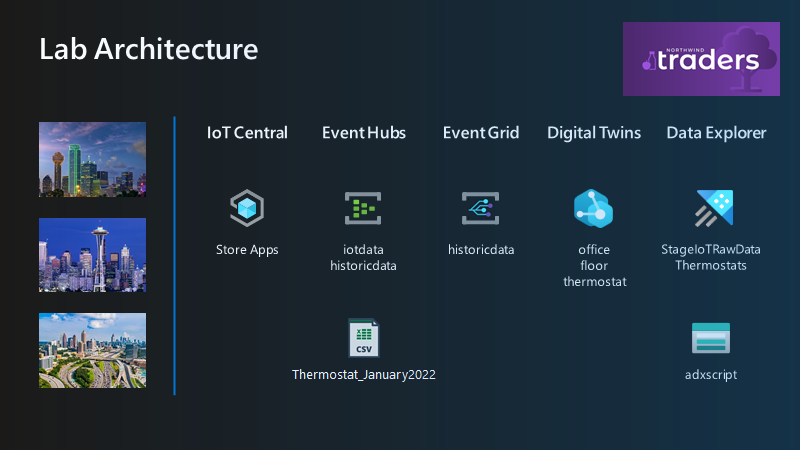
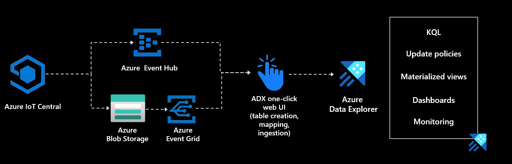
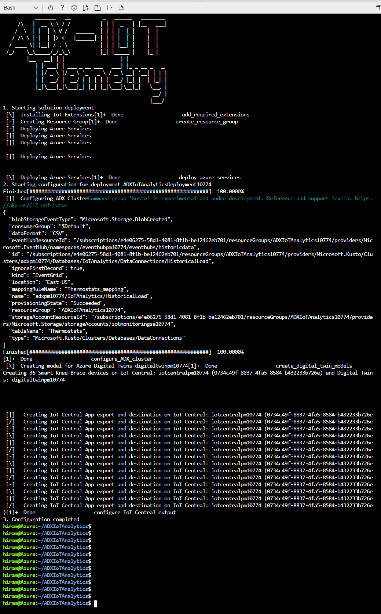

# ADX IoT Analytics Accelerator
Azure Data Explorer can provide valuable insights into your IoT workloads. In this accelerator we will showcase what an IoT analytics solution would look like using simulated IoT Devices. This accelerator allows you to choose between two different demo solutions.  

- ADX IoT Workshop
This will deploy a completely configured environment where after deployment you'll have simulated devices, an Azure Digital Twins representation, configured Azure Data Explorer cluster with both historical data (month of January) and new simulated data flowing in through Event Hub via IoT Central. This will allow you to get to the KQL query experience immediately after deployment.
  - IoT Central Store Analytics Template 
    - 36 thermostat devices being created and simulated
    - Setup Export to Event Hub of telemetry data
  - Event Hub 
    - Data exported from IoT Central
    - ADX Data Connection to ingest data
  - Azure Digital Twins
    - Office, Floors, and Thermostat twins
    - Atlanta, Dallas, Seattle offices with 6 Floors in each
    - 36 Thermostat twins created spread across the 3 offices with 2 on each floor
  - Azure Data Explorer
    - StageIoTRaw table where data lands from Event Hub to get new data
    - Thermastat table with update policy to transform raw data
    - Historical data from January 2022 loaded into Thermostat table
    - Two functions
      - GetDevicesbyOffice: query ADT by Office names to get all DeviceIds at the office
      - GetDevicesbyOfficeFloor: query ADT by Office and Floor to get all Devices on that floor 
- [ADX IoT MicroHack](https://github.com/Azure/azure-kusto-microhack)
This deploys the components needed for your IoT Analytics and lets you experience setting up the Azure Data Explorer Cluster and configuring the data ingestion.
  - IoT Central Logistics Template 
    - 1000 logistic devices being created and simulated
    - Setup Export to Event Hub of telemetry data
  - Event Hub 
  - Storage Account


## Deployment instructions

On the [Azure Cloud Shell](https://shell.azure.com/) run the following commands to deploy the accelerator:
1. Login to Azure
    ```bash
    az login
    ```

    **Note: You must do this step or you will see errors when running the script when connecting to IoT Central**

2. If you have more than one subscription, select the appropriate one:
    ```bash
    az account set --subscription "<your-subscription>"
    ```

3. Get the latest version of the repository
    ```bash
    git clone https://github.com/MSUSSolutionAccelerators/ADX-IoT-Analytics-Solution-Accelerator.git
    ```

4. Deploy solution
    ```bash
    cd ADXIoTAnalytics
    . ./deploy.sh
    ```

5. Choose which environment to deploy from the options provided 

### IoT Analytics Workshop 



Explore the data in ADX. Here is some sample queries to get you started! [KQL Sample](kqlsample/Sample.kql)

### IoT MicroHack

Explore content [here](https://github.com/Azure/azure-kusto-microhack)

 

### Deployment Example:


## Files used in the solution

- **asssets folder**: contains the following files:
  - AutomationPresentation.gif: quick explanation of the solution
  - Connected_Devices.pbix : sample report to visualize the data

- **config folder**: contains the configDB.kql that includes the code required to create the Azure Data Explorer tables and functions

- **dtconfig folder**: contains the files necessary to configure the Azure Digital Twins service:
  - Departments.json
  - Facility.json
  - KneeBrace.json
  - VirtualPatch.json

- **modules folder**: contains the [Azure Bicep](https://docs.microsoft.com/EN-US/azure/azure-resource-manager/bicep/) necessary to deploy and configure the resource resources used in the solution:
  - adx.bicep: ADX Bicep deployment file
  - digitaltwin.bicep: Digital Twin Bicep deployment file
  - eventhub.bicep: Event Hub Bicep deployment file
  - iotcentral.bicep: IoT Central Bicep deployment file
  - storage.bicep: Storage Bicep deployment file. This account is used as temporary storage to download ADX database configuration scripts)

- deploy.sh: script to deploy the solution. THe only one you need to run 
- main.bicep: main Bicep deployment file. It includes all the other Bicep deployment files (modules)
- patientmonitoring.parameters.json: parameters file used to customize the deployment
- README.md: This README file

## License

Copyright (c) Microsoft Corporation

All rights reserved.

MIT License

Permission is hereby granted, free of charge, to any person obtaining a copy of this software and associated documentation files (the ""Software""), to deal in the Software without restriction, including without limitation the rights to use, copy, modify, merge, publish, distribute, sublicense, and/or sell copies of the Software, and to permit persons to whom the Software is furnished to do so, subject to the following conditions:

The above copyright notice and this permission notice shall be included in all copies or substantial portions of the Software.

THE SOFTWARE IS PROVIDED AS IS, WITHOUT WARRANTY OF ANY KIND, EXPRESS OR IMPLIED, INCLUDING BUT NOT LIMITED TO THE WARRANTIES OF MERCHANTABILITY, FITNESS FOR A PARTICULAR PURPOSE AND NONINFRINGEMENT. IN NO EVENT SHALL THE AUTHORS OR COPYRIGHT HOLDERS BE LIABLE FOR ANY CLAIM, DAMAGES OR OTHER LIABILITY, WHETHER IN AN ACTION OF CONTRACT, TORT OR OTHERWISE, ARISING FROM, OUT OF OR IN CONNECTION WITH THE SOFTWARE OR THE USE OR OTHER DEALINGS IN THE SOFTWARE

## Contributing

This project welcomes contributions and suggestions.  Most contributions require you to agree to a
Contributor License Agreement (CLA) declaring that you have the right to, and actually do, grant us
the rights to use your contribution. For details, visit https://cla.opensource.microsoft.com.

When you submit a pull request, a CLA bot will automatically determine whether you need to provide
a CLA and decorate the PR appropriately (e.g., status check, comment). Simply follow the instructions
provided by the bot. You will only need to do this once across all repos using our CLA.

This project has adopted the [Microsoft Open Source Code of Conduct](https://opensource.microsoft.com/codeofconduct/).
For more information see the [Code of Conduct FAQ](https://opensource.microsoft.com/codeofconduct/faq/) or
contact [opencode@microsoft.com](mailto:opencode@microsoft.com) with any additional questions or comments.

## Trademarks

This project may contain trademarks or logos for projects, products, or services. Authorized use of Microsoft 
trademarks or logos is subject to and must follow 
[Microsoft's Trademark & Brand Guidelines](https://www.microsoft.com/en-us/legal/intellectualproperty/trademarks/usage/general).
Use of Microsoft trademarks or logos in modified versions of this project must not cause confusion or imply Microsoft sponsorship.
Any use of third-party trademarks or logos are subject to those third-party's policies.
